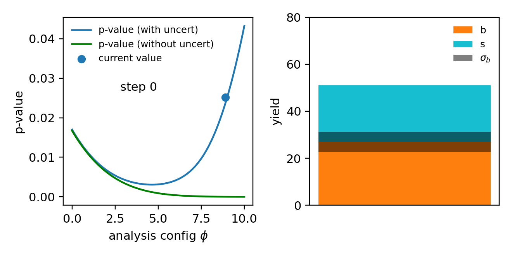

Overview 🌐
=========================

``relaxed`` provides common operations in high-energy physics (HEP) that are both *differentiable* and *hardware-accelerated* on GPUs and TPUs, thanks to `jax <http://github.com/google/jax>`_.

The key use case of ``relaxed`` is facilitating gradient-based optimisation in HEP workflows, e.g. optimising an analysis configuration for the best discovery significance, which looks like this:

.. toctree::
   :maxdepth: 2
   :titlesonly:
   :caption: Contents
   :glob:

   relaxed-101.md
   examples.rst
   modules.rst
   contributing.md

Indices and tables
==================

* :ref:`genindex`
* :ref:`modindex`
* :ref:`search`
